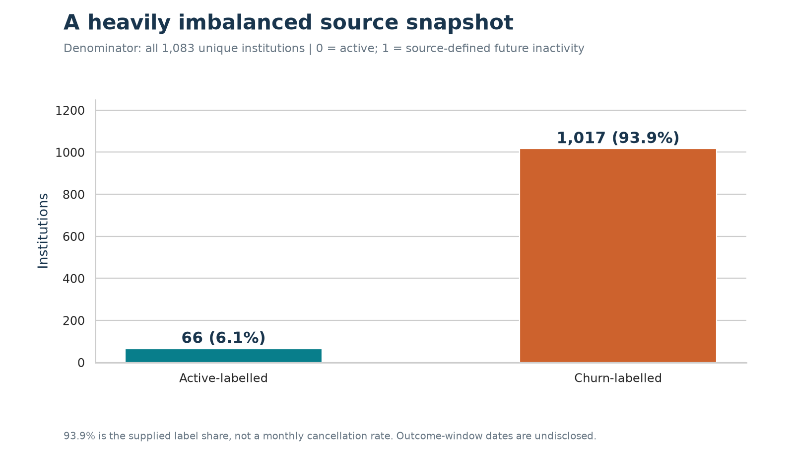
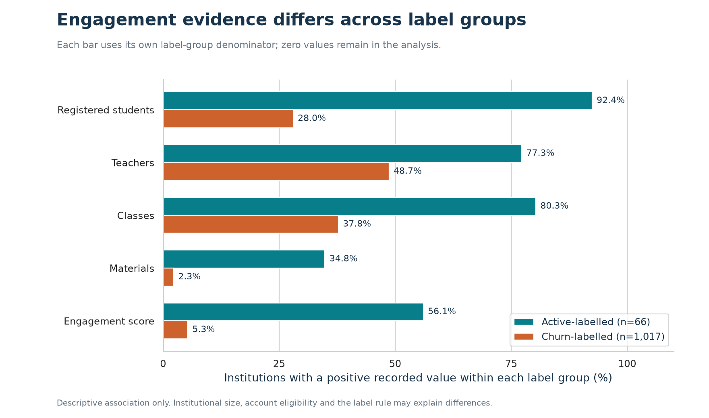
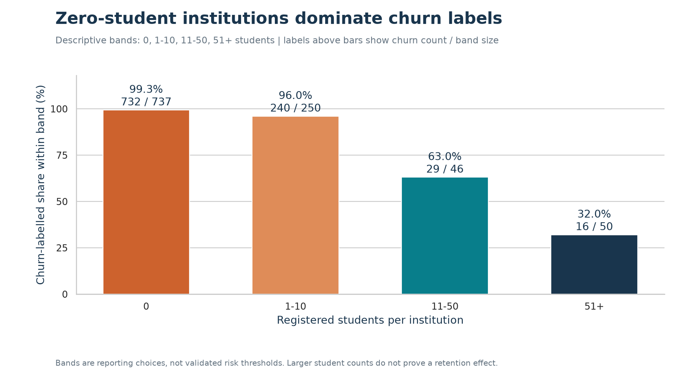

# 📊 SaaS Retention & Engagement Insights

SaaS Retention & Engagement Insights is an end-to-end **descriptive data analytics case study** focused on institutional engagement patterns and source-provided churn labels in an educational SaaS environment.

The project uses **Python and Pandas** for validation and analysis, **DuckDB SQL** for business queries, and **Matplotlib / Seaborn** for evidence-based visual reporting. Predictive modelling was assessed but intentionally withheld because the released snapshot does not provide enough temporal information to independently validate a future-churn target.



## 🎯 Business Problem

A SaaS business wants to understand how institutional engagement differs across active-labelled and churn-labelled accounts and identify groups that should be reviewed before customer-retention outreach.

The main question behind the project is:

> How can institutional engagement data be used to identify meaningful retention patterns and support better customer-success decisions without overstating what the available data can prove?

## 🚀 Project Objectives

- Measure the distribution of source-provided active and churn labels.
- Compare engagement indicators across label groups.
- Analyze institutional size using registered-student segments.
- Evaluate material usage and other engagement signals.
- Identify data-quality and account-review groups for further investigation.
- Reconcile SQL results independently with Pandas.
- Produce evidence-backed business recommendations.
- Assess whether the available snapshot is suitable for predictive churn modelling.

## 📦 Dataset Overview

The source dataset contains **1,083 anonymised educational institutions** and **9 columns**, with one row per institution.

| Area | Details |
|---|---|
| Institutions | 1,083 |
| Unique institution IDs | 1,083 |
| Columns | 9 |
| Churn-labelled institutions | 1,017 |
| Active-labelled institutions | 66 |
| Source label share marked churn | 93.91% |
| Recorded students | 10,213 |
| Recorded teachers | 846 |
| Recorded classes | 1,313 |
| Recorded materials | 108 |
| Missing cells | 0 |
| Duplicate institution IDs | 0 |
| Rows removed | 0 |
| Values changed | 0 |

> **Important:** 93.91% is the share of rows carrying the supplied churn label in this snapshot. It is **not** presented as a monthly or annual churn rate.

Important fields include `institution_id`, `attendance_count`, `material_count`, `assessment_count`, `teacher_count`, `student_count`, `class_count`, `engagement_score`, and `churn_label`.

## 🛠️ Tools Used

| Tool | Use in this project |
|---|---|
| Python | Validation, analysis automation, reporting, and reproducibility |
| Pandas | Independent descriptive analysis and SQL-result reconciliation |
| DuckDB / SQL | Aggregations, segmentation, CTEs, CASE logic, and window calculations |
| NumPy | Numerical support for analysis |
| Matplotlib | Evidence-based charts |
| Seaborn | Distribution and comparison visualizations |
| Jupyter Notebook | Executed analytical walkthrough with visible outputs |
| HTML / Markdown Reports | Business findings, evidence, feasibility, and verification documentation |

## 🔄 Project Workflow

```text
Source SaaS Snapshot
        |
        v
Source & Licence Review
        |
        v
Data Quality Validation
        |
        v
Python / Pandas Analysis
        |
        v
DuckDB SQL Business Analysis
        |
        v
SQL ↔ Pandas Reconciliation
        |
        v
Charts & Evidence Reports
        |
        v
Business Findings & Recommendations
        |
        v
Prediction Feasibility Assessment
```

## 🐍 Data Validation & Preparation

The original source values were deliberately preserved rather than aggressively cleaned or imputed.

Main validation steps:

- Confirmed **1,083 rows** and **9 columns**.
- Verified **0 missing cells**.
- Verified **0 duplicate institution IDs**.
- Removed **0 rows** and changed **0 source values**.
- Preserved institutions with matching zero-heavy profiles because they have distinct valid IDs.
- Identified `attendance_count` and `assessment_count` as constant zero fields.
- Flagged unusual score/count combinations for review instead of silently correcting them.
- Preserved the raw source file and verified its checksum.
- Exported a typed processed CSV without altering source values.

The project also tests invalid labels, negative counts, missing values, and duplicate IDs so that bad inputs fail validation instead of passing silently.

## 🗄️ SQL Business Analysis

The `sql/` folder contains six business-analysis queries:

1. Headline institutional metrics.
2. Active vs churn-label distribution.
3. Student-size segmentation.
4. Engagement summary by label.
5. Material-usage segmentation.
6. Operational review groups.

### 💻 SQL Techniques Demonstrated

- `GROUP BY` and aggregate functions
- `CASE WHEN`
- Common Table Expressions (CTEs)
- Window functions
- Conditional aggregation
- Median and quantile calculations
- Lateral row expansion
- Contribution percentages
- Segmentation logic

Because the released source is a single institution-level table, artificial joins were not added simply to make the project appear more complex.

## 📊 Visual Analysis

### Churn-label distribution


### Engagement comparison



### Student-size segments



All six project charts are stored in the `images/` directory, and their underlying CSV evidence is documented in `reports/tables/figure_index.csv`.

## 🔍 Key Findings

### 1. Most institutions carry the supplied churn label

**1,017 of 1,083 institutions (93.91%)** are churn-labelled, while **66 institutions** are active-labelled.

This describes the supplied snapshot only and should not be interpreted as a monthly churn rate.

### 2. Zero-student institutions are heavily concentrated in the churn-labelled group

Among **737 institutions with zero recorded students**, **732 (99.32%)** are churn-labelled.

For institutions with **51+ registered students**, **16 of 50 (32.00%)** are churn-labelled.

This is a strong descriptive association, but the available data does not establish that institution size causes churn.

### 3. Material activity differs strongly across label groups

Among institutions with materials recorded, **23 of 46 (50.00%)** are churn-labelled.

Among institutions with no materials recorded, **994 of 1,037 (95.85%)** are churn-labelled.

The association is useful for investigation, but it should not be interpreted as proof that publishing materials prevents churn.

### 4. Two activity fields contain no variation

`attendance_count` and `assessment_count` are zero for every institution.

These fields cannot explain differences between accounts in the released snapshot and should be reviewed for data-capture or source-definition issues.

### 5. Several operational review groups deserve follow-up

Examples include:

| Review Group | Institutions |
|---|---:|
| Active label; no materials recorded | 43 |
| Active label; no teacher or no class recorded | 19 |
| Positive engagement score; all six counts zero | 16 |
| Materials recorded; engagement score zero | 5 |
| Active label; no students recorded | 5 |

These groups overlap and are **not** a validated churn-risk ranking.

### 6. Results were independently reconciled

The project includes **130 SQL–Pandas comparison checks**, and the packaged verification report records them as passing.

This helps demonstrate that the published analytical tables are reproducible across two independent calculation paths.

## 💡 Business Recommendations

- **Validate the account denominator and event capture:** Review zero-student institutions and the two constant activity fields before using the data for retention targeting.
- **Audit active accounts with incomplete setup signals:** Investigate active-labelled institutions with no teacher, class, students, or materials recorded.
- **Test guided onboarding:** For confirmed eligible accounts, run a controlled onboarding intervention and measure setup completion and later qualifying activity.
- **Review material-workflow support:** Material usage shows a notable descriptive association with labels, making it a reasonable workflow to test rather than assume as causal.
- **Define retention outcomes clearly:** Separate product inactivity from paid subscription cancellation and use a pre-defined activity window before measuring retention impact.
- **Collect dated snapshots before predictive ML:** Add feature cutoffs, account age, eligibility, event timestamps, and independently observed future outcomes.

## ⚠️ Prediction Feasibility & Project Limits

A future-churn model was **not trained** from this snapshot.

The released data does not provide the exact inactivity rule, complete outcome window, per-account feature cutoff, engagement-score formula, or sufficient dated snapshots needed to independently verify a temporal prediction target.

Therefore, this project does **not** claim:

- Model accuracy or churn-risk scores
- SHAP explanations
- Monthly or annual churn rate
- Cohort retention
- Revenue uplift
- Campaign effectiveness
- Causal impact of engagement features

This limitation is intentional: the project prioritizes defensible analysis over unsupported modelling claims.

## 📁 Repository Structure

```text
SaaS Retention & Engagement Insights/
│
├── data/
│   ├── raw/
│   │   └── institutions.csv
│   ├── processed/
│   │   └── institutions_clean.csv
│   └── samples/
│       └── institutions_sample.csv
│
├── sql/
│   ├── 01_headline.sql
│   ├── 02_label_distribution.sql
│   ├── 03_student_segments.sql
│   ├── 04_engagement_summary.sql
│   ├── 05_material_segments.sql
│   └── 06_review_groups.sql
│
├── notebooks/
│   └── 01_saas_analysis.ipynb
│
├── src/
│   ├── analyze.py
│   ├── charts.py
│   ├── download_data.py
│   ├── execute_notebook.py
│   ├── verify.py
│   └── write_reports.py
│
├── images/
│   ├── 01_data_quality.png
│   ├── 02_churn_labels.png
│   ├── 03_engagement_comparison.png
│   ├── 04_student_segments.png
│   ├── 05_engagement_distributions.png
│   └── 06_review_workload.png
│
├── reports/
│   ├── business_findings.md
│   ├── evidence_report.html
│   ├── model_feasibility.md
│   ├── source_and_dictionary.md
│   ├── verification.json
│   └── tables/
│
└── README.md
```

## ▶️ How to Run the Project

### 1️⃣ Create a virtual environment

```bash
python -m venv .venv
```

**Windows**

```bash
.venv\Scripts\activate
```

**macOS / Linux**

```bash
source .venv/bin/activate
```

### 2️⃣ Install the required packages

```bash
pip install pandas numpy duckdb matplotlib seaborn pillow nbformat nbclient ipykernel jupyterlab
```

The delivered environment was tested with Python 3.12.

### 3️⃣ Run the analysis

```bash
python src/analyze.py
```

This runs the SQL analysis, computes matching Pandas results, exports analytical tables, and regenerates charts and reports.

### 4️⃣ Run verification

```bash
python src/verify.py
```

This checks source integrity, validation rules, SQL–Pandas agreement, and generated image files.

### 5️⃣ Execute the notebook

```bash
python src/execute_notebook.py
```

Or open it interactively:

```bash
jupyter lab notebooks/01_saas_analysis.ipynb
```

### 6️⃣ Optional source re-download

The raw CSV is already included. To re-download and verify the published source:

```bash
python src/download_data.py
```

## 🧠 Skills Demonstrated

`Python` `Pandas` `NumPy` `DuckDB` `SQL` `CTEs` `Window Functions` `CASE` `Data Validation` `Data Quality` `Segmentation` `Descriptive Analytics` `Matplotlib` `Seaborn` `Jupyter` `KPI Analysis` `Business Analysis` `Reproducibility` `SQL-Pandas Reconciliation` `Retention Analysis` `Experiment Design`

## 📂 Project Files

- [Executed Analysis Notebook](notebooks/01_saas_analysis.ipynb)
- [Business Findings](reports/business_findings.md)
- [Visual Evidence Report](reports/evidence_report.html)
- [Prediction Feasibility](reports/model_feasibility.md)
- [Source & Data Dictionary](reports/source_and_dictionary.md)
- [Verification Results](reports/verification.json)
- [SQL Analysis](sql/)
- [Charts](images/)

## 📚 Data Source & Attribution

Dataset source:

**Simanjuntak, T., Hafizh, M., Siahaan, H., & Prasandy, T. (2026).**  
*User Engagement-Based Institutional Churn Analysis in Educational SaaS: An End-to-End Business Analytics and Lakehouse Approach.*

- Source: Zenodo
- DOI: https://doi.org/10.5281/zenodo.21759158
- Licence: CC BY 4.0
- Source publication date: 2026-08-02
- Reported observation cutoff: before 2026-05-01

The source data is attributed to its original authors. The analysis code and project reporting in this repository are independently prepared.

## 👤 Author

**Babasaheb Patil**

- GitHub: [babasahebpatil-ai](https://github.com/babasahebpatil-ai)
- LinkedIn: [Babasaheb Patil](https://www.linkedin.com/in/babasaheb-patil-22a476319)
